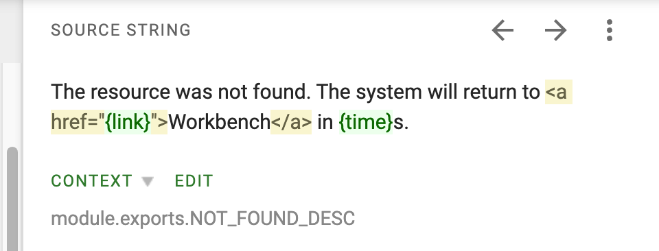

# Join the KubeSphere Localization Project

The KubeSphere localization project is now available on Crowdin. This document describes how you can help localize the KubeSphere web console to make KubeSphere available to users of all regions, speaking all languages, and from all cultural backgrounds.

## Start Localizing the KubeSphere Web Console

The locale files containing UI strings of the KubeSphere web console have been uploaded to Crowdin. Perform the following steps to start localizing the KubeSphere web console.

1. Visit https://crwd.in/kubesphere and log in with your GitHub account to join the KubeSphere localization project.

2. Select a language and a locale file to start translating the UI strings. If your language does not exist in the list, please open an issue at the [kubesphere/console repository](https://github.com/kubesphere/console/issues).

   > **Note**: Chinese Simplified is maintained by KubeSphere SIG-Docs. If you have any suggestions on the existing Chinese Simplified UI strings, please open an issue at the [kubesphere/console repository](https://github.com/kubesphere/console/issues).

   

3. On the translation editing page, select a UI string, enter your translation, and click **Save** to translate the string. Keep HTML tags and words enclosed in braces ({}) unchanged in your translations. Words enclosed in braces are variables and the values are dynamically loaded.

   For example, keep **\<a href="{link}"\>**, **\</a\>**, and **{time}** unchanged in your translation for the following UI string.
   
   
   

For more information about operations on Crowdin, see the [official Crowdin documentation](https://support.crowdin.com/).

## Obtain Context and Preview Your Translations

On Crowdin, obtain the paths of the UI strings from the locale file names and comments.

For example, the following file name and comment indicate that the string **Platform Roles** is located in the banner area of the **Platform Roles** page.

## Pending Issues

Localizing a software platform is a tough task and many issues could become obstacles for localization. Though plenty of these issues have been realized and resolved, some still remain unresolved due to various reasons, which you may need to be aware of.

* The KubeSphere web console is under rapid iteration, which means function modules could be added, removed, or modified, and the current locale files could be updated rapidly.
* The KubeSphere team has been working to optimize the English UI strings, which are used as the source text in localization. However, there are still certain flaws in the English UI strings to be resolved in future updates.
* Concatenated UI strings could make localization difficult or even impossible, which have not been completely eliminated from the KubeSphere web console.
* Languages such as Arabic and Hebrew are read from right to left, which require the layout of web console to be mirrored. This feature is currently not supported and is planned in future versions. 

All preceding issues will be resolved in subsequent updates to the locale files and the console source code.

## Support and Discussion

Translations of the UI strings will be merged into the master branch of the [kubesphere/console repository](https://github.com/kubesphere/console/issues), and will become available to users around the world in the next KubeSphere release.

If you encounter any obstacles in the localization process, feel free to open issues at the [kubesphere/console repository](https://github.com/kubesphere/console/issues).

Join the [KubeSphere #sig-console Slack channel](https://kubesphere.slack.com/archives/C010UN5BMRR) to discuss localization issues, share localization skills, or simply tell us how you feel when using the KubeSphere web console.
